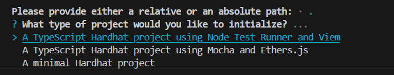

# 🎯 Hướng Dẫn Bài 7.1 - Mint Token ERC20
npx hardhat --init
xong chọn 3 
hardhat-3

chọn thứ 2 A TypeScript Hardhat project using Mocha and Ethers.js

npm install @nomicfoundation/hardhat-toolbox-mocha-ethers @openzeppelin/contracts

npm install @openzeppelin/contracts

Cài dotenv để load .env
cd MyMintableToken
npm install dotenv


Lệnh này sẽ cài:
npm install --save-dev hardhat-deploy
hardhat-deploy ✅
hardhat/types ✅


## 📋 Yêu Cầu
1. Viết contract `MyMintableToken` kế thừa **ERC20** + **Ownable**
2. Hàm `mint()` chỉ owner gọi được
3. Viết script deploy để mint 1000 token
4. In balance của deployer

---

## ✅ Các Bước Thực Hiện

### **Bước 1: Tạo Contract Solidity**
📁 Tạo file: `MyMintableToken.sol`

**Nội dung:**
- Import `ERC20` từ `@openzeppelin/contracts/token/ERC20/ERC20.sol`
- Import `Ownable` từ `@openzeppelin/contracts/access/Ownable.sol`
- Kế thừa 2 contract này: `contract MyMintableToken is ERC20, Ownable`
- Constructor:
  - Gọi `ERC20("MyMintableToken", "MMT")` để đặt tên + ký hiệu
  - Ban đầu totalSupply = 0
- Hàm `mint(address to, uint256 amount)`:
  - Modifier `onlyOwner` để chỉ owner gọi
  - Dùng `_mint(to, amount)` để tạo token
  - Có thể phát event `TokenMinted`

**Gợi ý:**
```solidity
contract MyMintableToken is ERC20, Ownable {
    constructor() ERC20("MyMintableToken", "MMT") {}
    
    function mint(address to, uint256 amount) public onlyOwner {
        _mint(to, amount);
    }
}
```

---

### **Bước 2: Tạo Script Deploy**
📁 Tạo file: `1-deploy-token.ts`

**Nội dung:**
```typescript
import { ethers } from "hardhat";

async function main() {
    // Lấy contract factory
    const MyMintableToken = await ethers.getContractFactory("MyMintableToken");
    
    // Deploy contract
    const token = await MyMintableToken.deploy();
    await token.deployed();
    console.log("✅ Contract deployed at:", token.address);
    
    // Lấy deployer address
    const [deployer] = await ethers.getSigners();
    
    // Mint 1000 token (1000 * 10^18 wei)
    const mintAmount = ethers.utils.parseEther("1000");
    const tx = await token.mint(deployer.address, mintAmount);
    await tx.wait();
    console.log("✅ Mint 1000 token thành công");
    
    // Kiểm tra balance
    const balance = await token.balanceOf(deployer.address);
    const balanceFormatted = ethers.utils.formatEther(balance);
    console.log("💰 Balance:", balanceFormatted, "MMT");
    
    // Kiểm tra totalSupply
    const totalSupply = await token.totalSupply();
    console.log("📊 Total supply:", ethers.utils.formatEther(totalSupply), "MMT");
}

main()
    .then(() => process.exit(0))
    .catch((error) => {
        console.error(error);
        process.exitCode = 1;
    });
```

---

### **Bước 3: Chạy Deploy**
```bash
# Compile contract
npx hardhat compile

# Deploy trên localhost
npx hardhat run 1-deploy-token.ts --network localhost

# Hoặc deploy trên sepolia
npx hardhat run 1-deploy-token.ts --network sepolia
```

---

## 🧪 Kiểm Tra Kết Quả
✅ Xem output:
- Contract address
- Balance của deployer = 1000 MMT
- Total supply = 1000 MMT

---

## 💡 Điểm Quan Trọng
| Khái Niệm | Giải Thích |
|-----------|-----------|
| **ERC20** | Chuẩn token trên Ethereum |
| **Ownable** | Cấp quyền `onlyOwner` |
| **mint()** | Tạo token mới |
| **_mint()** | Hàm nội bộ của ERC20 |
| **balanceOf()** | Lấy số dư |
| **totalSupply()** | Tổng cung token |
| **parseEther()** | Chuyển từ token → wei (18 decimals) |
| **formatEther()** | Chuyển từ wei → token |

---

## 🔧 Các Hàm Quan Trọng
- `mint(address to, uint amount)` - tạo token
- `balanceOf(address owner)` - xem số dư
- `totalSupply()` - xem tổng cung
- `transfer(address to, uint amount)` - gửi token
- `owner()` - xem owner hiện tại

---

Good luck! 🚀
